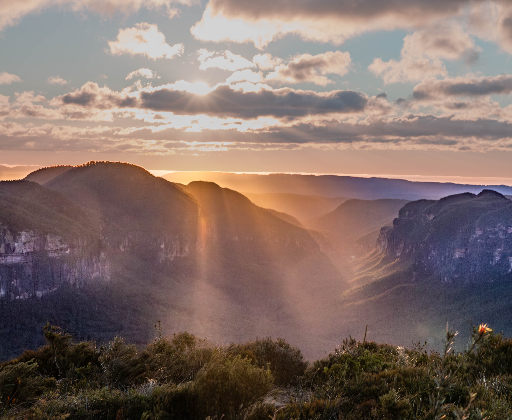

It's been another two years since I wrote my last article here.

Lots has happened in two years.

But as of now, I thought I'd share my latest photography here.

This photo was shot on a windy June morning at Lockley's Pylon in the Blue Mountains.

A 03:45am wake up and drive up to the Blue Mountains, guided by a friend of mine who has been photographing the area for a decade.

Stunning.